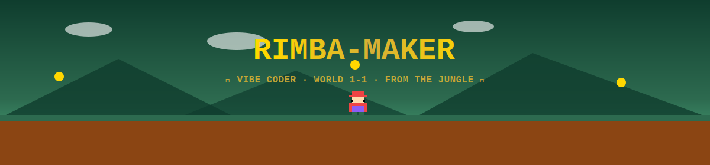

<!-- ====================== HERO (animated) ====================== -->
<div align="center">



</div>

<!-- ====================== TYPING (animated) ====================== -->
<div align="center">

[](https://git.io/typing-svg)

</div>

<br/>

<!-- ====================== SNAKE (animated) ====================== -->
<div align="center">


</div>

---

## 🏰 Player Card

<div align="center">



</div>

---

## 🌿 Featured Quest — Marryio

> **Marryio** — Digital wedding invitation SaaS targeting the Indonesian market. 13+ premium templates, custom domains, RSVP management, guestbook, gift registry, analytics. Built solo end-to-end with Next.js 14 App Router, Supabase, Tailwind v4, TypeScript.

**Architecture:** Turborepo monorepo · Feature-Sliced Design · Open/Closed principle
**Status:** 🟢 Production · 🎯 Scaling to Indonesian market first, then worldwide

[](https://marryio.com)
[](https://rimba.dev)

---

## 🎯 Currently Open For

```ts
const rimba = {
  seeking: ["Remote full-time", "Freelance contracts", "Product collabs"],
  stack: ["Next.js", "TypeScript", "Supabase", "Tailwind", "FSD"],
  timezone: "GMT+7 (Asia/Jakarta)",
  englishLevel: "Professional working proficiency",
  reachMe: "rimba.dev / Discord: gaztorgat",
} as const;
```

---

## 🧱 Inventory — Tech Stack

<div align="center">


</div>

**🔴 Languages**


**⭐ Royal Stack (Vibe Coding Chosen Ones)**


**🍄 Vibe Power-ups**


---

## ⭐ Stats Board

<div align="center">



<br/>

<a href="https://github.com/Rimba-maker">
  
  
</a>

<br/><br/>


</div>

---

## 🗺️ Activity Map

<div align="center">

[](https://github.com/Rimba-maker)

</div>

---

## 🪠 Warp Pipes

<div align="center">



<br/><br/>

[](https://rimba.dev)
[](https://marryio.com)
[](https://instagram.com/ccbmantara)
[](https://discord.com/users/gaztorgat)

</div>

---

<!-- ====================== FOOTER (animated) ====================== -->
<div align="center">


</div>
