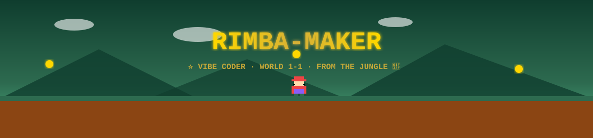

<!-- ====================== HERO (animated) ====================== -->

<!-- ====================== TYPING (animated) ====================== -->

 

<!-- ====================== SNAKE (animated) ====================== -->

---

## 🏰 Player Card

---

## 🧱 Inventory — Tech Stack

<!-- Row 1: Languages -->

 

<!-- Row 2: Frontend -->

 

<!-- Row 3: Backend & DB -->

 

<!-- Row 4: Tools & Infra -->

 

**🔴 Languages**

**⭐ Royal Stack — Vibe Coding Chosen Ones**

**🔵 Frontend Motion & UI**

**🟣 Backend, DB & Infra**

**🛠️ Tooling & Workflow**

**🍄 Vibe Power-ups**

---

## ⭐ Stats Board

 

  

---

## 🗺️ Activity Map

---

## 🪠 Warp Pipes — Find Me

  

---

<!-- ====================== FOOTER (animated) ====================== -->

